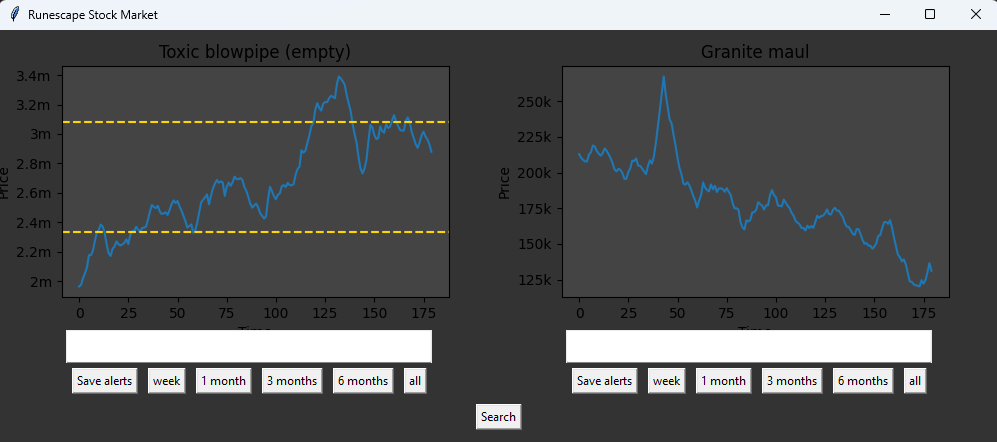

# OSRS Flipping Assistant

## Overview

### Features
User can add items they want to track to json/flipping_items.json. Auto complete entry boxes to change what item is currently displayed in the plots. Can change the history length of the data using preset buttons on the GUI.

## API

Information currently comes from [OSRS wiki](https://runescape.wiki/w/Application_programming_interface)

## How to use
1 - Install all dependancies (Matplotlib, tkinter, numpy etc)

2 - Run OSRS_flipping_assistant.py

## To do
### Immediate ideas
- Make GUI nicer

- Setup email alert code, email sent with some set frequency about possible investment opportunities. Good fortmat for email alert code would be to create a mini document periodically with all relevant data.

- Start tracking price data periodically and adding it to data folder. OSRS wiki only shows last 6 months.

- Investigate using runelite publicly available [wiki](https://oldschool.runescape.wiki/w/RuneScape:Real-time_Prices). Has more up to date prices, and volume trends.

- Add a requirements.txt to easily install dependancies

- Fix dates on bottom of graph

- Add volume trends to graphs

### Stretch goals

- Ability to log items bought and quantities, as well as when sold to track how well flipping is going.

- AI to learn trends to advise for buying and selling? (overkill but why not?)
